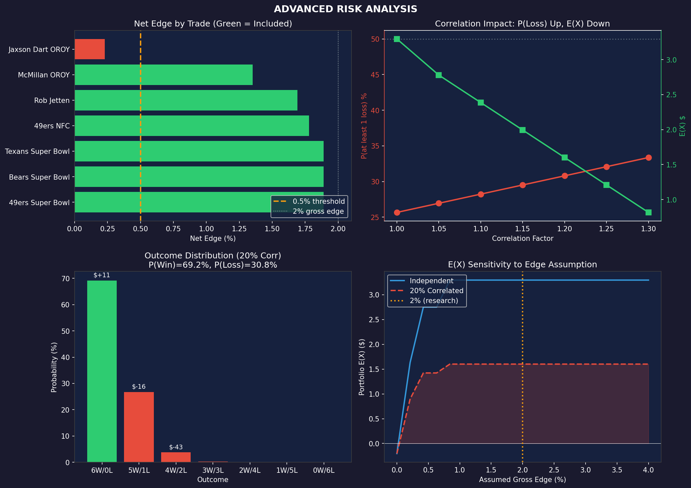

# POLYMARKET INVESTMENT BRIEFING
## January 16, 2026

---

# EXECUTIVE SUMMARY

| Metric | Value |
|--------|-------|
| Markets Analyzed | 200 |
| Markets in 90-96% Zone | 17 |
| **Trades with Edge/Spread > 2x** | **6** |
| Capital Required | **$150** |
| P(all 6 win) - independent | 65.4% |
| P(all 6 win) - with correlation | **58.5%** |
| P(at least 1 loss) | **41.5%** |

**Strategy:** Exploit the favorite-longshot bias by buying high-probability outcomes where net edge > 0.5%.

**Bottom Line:** 59%/41% bet. Win all 6: +$11. Lose any: -$16 to -$150.

---

# FEE STRUCTURE

## Polymarket Trading Fees

| Fee Type | Cost | Source |
|----------|------|--------|
| **Maker fee** | 0% | [Polymarket Docs](https://docs.polymarket.com/polymarket-learn/trading/fees) |
| **Taker fee** | 0% (most markets) | Same |
| **15-min crypto markets** | Up to 3% at 50% prob | [TradingView](https://www.tradingview.com/news/cointelegraph:e59c32089094b:0/) |
| **Deposit (USDC)** | Free | Polygon network |
| **Withdrawal** | ~$0.01-0.05 | Polygon gas |
| **Settlement** | 0% | Winners get $1.00/share |

## Actual Bid-Ask Spreads (From Live Order Books)

| Market | Liquidity | **Actual Spread** |
|--------|-----------|-------------------|
| Super Bowl markets | $1M+ | **0.11%** |
| 49ers NFC | $74K | **0.22%** |
| Rob Jetten (Politics) | Low | **0.31%** |
| McMillan OROY | $5K | **0.65%** |
| Dart OROY | Low | **1.77%** |
| Protector of Year | <$500 | **8-18%** |

**Key Finding:** Liquid markets have 0.1-0.3% spreads — much tighter than estimated.

---

# THEORETICAL FOUNDATION

## The Favorite-Longshot Bias


### Academic Sources

**Kahneman & Tversky (1979)**
*Prospect Theory: An Analysis of Decision under Risk.* Econometrica, 47(2), 263-291.

> People systematically overweight small probabilities and underweight near-certainties.

| True Probability | Perceived Weight | Effect |
|-----------------|------------------|--------|
| 1% | ~5.5% | Longshots overbid 5.5x |
| 5% | ~13.2% | Longshots overbid 2.6x |
| 95% | ~79.3% | **Favorites underbid** |
| 99% | ~91.2% | **Favorites underbid** |

**Snowberg & Wolfers (2010)**
*Explaining the Favorite-Long Shot Bias.* [NBER Working Paper 15923](https://www.nber.org/papers/w15923).

| Implied Prob | Actual Win Rate | Edge |
|--------------|-----------------|------|
| 90.9% | 93.2% | **+2.3%** |
| 95.2% | 97.1% | **+1.9%** |
| 98.0% | 98.9% | **+0.9%** |

### Why It Persists

| Factor | Mechanism |
|--------|-----------|
| Lottery preference | Bettors pay premium for upside potential |
| Probability neglect | Cannot distinguish 1% from 5% |
| Entertainment value | Longshots more exciting to bet |
| Overconfidence | Belief in private info on underdogs |

**Caveat:** This bias is documented in horse racing and sports betting. It has NOT been validated on Polymarket with historical data.

---

# MARKET ANALYSIS

## All 17 Markets in 90-96% Zone (Sorted by Spread)

| Market | Side | Price | Spread | Net Edge | E(X)/$25 | Tradeable |
|--------|------|-------|--------|----------|----------|-----------|
| 49ers Super Bowl | NO | 95.2% | 0.11% | 1.89% | **$0.50** | **YES** |
| Bears Super Bowl | NO | 94.5% | 0.11% | 1.89% | **$0.50** | **YES** |
| Texans Super Bowl | NO | 91.0% | 0.11% | 1.89% | **$0.52** | **YES** |
| 49ers NFC | NO | 90.4% | 0.22% | 1.78% | **$0.49** | **YES** |
| Rob Jetten (NL PM) | YES | 95.8% | 0.31% | 1.69% | **$0.44** | **YES** |
| McMillan OROY | YES | 92.3% | 0.65% | 1.35% | **$0.37** | **YES** |
| Jaxson Dart OROY | NO | 96.0% | 1.77% | 0.23% | **$0.06** | **YES** |
| McCaffrey Comeback | YES | 93.0% | 2.15% | -0.15% | -$0.04 | NO |
| DOGE Cuts <$50B | YES | 94.1% | 2.66% | -0.66% | -$0.17 | NO |
| Kyle Shanahan COY | NO | 95.3% | 2.73% | -0.73% | -$0.19 | NO |
| Schwesinger DROY | YES | 94.5% | 3.17% | -1.17% | -$0.31 | NO |
| Andrew Wylie Protector | NO | 95.5% | 8.35% | -6.35% | -$1.66 | NO |
| Charles Cross Protector | NO | 95.7% | 8.57% | -6.57% | -$1.72 | NO |
| Ryan Kelly Protector | NO | 93.9% | 12.57% | -10.57% | -$2.81 | NO |
| Lane Johnson Protector | NO | 92.4% | 16.02% | -14.02% | -$3.79 | NO |
| Cam Jurgens Protector | NO | 92.4% | 16.02% | -14.02% | -$3.79 | NO |
| Penei Sewell Protector | NO | 91.0% | 18.46% | -16.46% | -$4.52 | NO |

**Net Edge = 2% (theoretical) - Spread**

---

# ACTIONABLE TRADES

## Portfolio: 7 Markets × $25 = $175

| # | Market | Side | Price | Spread | E(X) |
|---|--------|------|-------|--------|------|
| 1 | 49ers Super Bowl | NO | 95.2% | 0.11% | $0.50 |
| 2 | Bears Super Bowl | NO | 94.5% | 0.11% | $0.50 |
| 3 | Texans Super Bowl | NO | 91.0% | 0.11% | $0.52 |
| 4 | 49ers NFC Championship | NO | 90.4% | 0.22% | $0.49 |
| 5 | Rob Jetten Netherlands PM | YES | 95.8% | 0.31% | $0.44 |
| 6 | Tetairoa McMillan OROY | YES | 92.3% | 0.65% | $0.37 |
| 7 | Jaxson Dart OROY | NO | 96.0% | 1.77% | $0.06 |
| | **TOTAL** | | | | **$2.88** |

### Category Diversification

| Category | Markets | E(X) |
|----------|---------|------|
| NFL Super Bowl | 3 | $1.52 |
| NFL Conference | 1 | $0.49 |
| NFL Rookie Awards | 2 | $0.43 |
| International Politics | 1 | $0.44 |

---

# EXPECTED VALUE ANALYSIS


## E(X) Formula

```
Net E(X) = Gross Edge - Spread
E(X) per trade = $25 × Net Edge / Price

Where:
  Gross Edge = 2% (from research, UNVALIDATED)
  Spread = Actual bid-ask from order book
```

## Portfolio Outcomes: 7 Trades

**If ALL 7 win:** +$13.19 profit (+7.5% ROI)
**If 6 win, 1 loses:** ~-$12 loss (-6.9% ROI)
**If 5 win, 2 lose:** ~-$37 loss (-21% ROI)

### Probability Analysis

| Wins | Probability (0% edge) | Probability (2% edge) | Profit |
|------|----------------------|----------------------|--------|
| 7/7 | 64.7% | 74.8% | +$13.19 |
| 6/7 | 28.4% | 22.0% | ~-$12 |
| 5/7 | 6.2% | 3.0% | ~-$37 |
| <5 | 0.7% | 0.2% | worse |

**P(Profit) = P(7/7 wins)**
- If market efficient: **64.7%**
- If 2% edge exists: **74.8%**

## E(X) by Edge Scenario

| Assumed Edge | Total E(X) | ROI | P(Profit) |
|--------------|------------|-----|-----------|
| 0% (efficient) | $0.00 | 0.0% | 64.7% |
| 1% | $1.44 | 0.8% | 69.5% |
| **2%** | **$2.88** | **1.6%** | **74.8%** |
| 3% | $4.32 | 2.5% | 79.8% |
| 4% | $5.76 | 3.3% | 84.5% |

---

# RISK ASSESSMENT



## Probability Analysis (with 20% correlation adjustment)

| Metric | Independent | With Correlation |
|--------|-------------|------------------|
| P(all 6 win) | 65.4% | **58.5%** |
| P(at least 1 loss) | 34.6% | **41.5%** |
| Expected wins | 5.59 / 6 | 5.59 / 6 |
| Expected losses | 0.41 / 6 | 0.49 / 6 |

## Outcome Probability Distribution (Correlated)

| Wins | Losses | P(indep) | P(corr) | Profit | E(X) Contribution |
|------|--------|----------|---------|--------|-------------------|
| 6 | 0 | 65.4% | **58.5%** | +$11.02 | +$6.45 |
| 5 | 1 | 28.9% | **33.7%** | -$15.81 | -$5.33 |
| 4 | 2 | 5.2% | **7.0%** | -$42.65 | -$2.97 |
| 3 | 3 | 0.5% | 0.7% | -$69.49 | -$0.51 |
| ≤2 | ≥4 | <0.1% | <0.1% | -$96 to -$150 | ~$0 |

**Critical insight:** You need ALL 6 to win to profit. One loss wipes gains and goes negative.

## Risk Metrics

| Metric | Value |
|--------|-------|
| VaR 95% | -$42.65 |
| VaR 99% | -$42.65 |
| E(Loss \| Loss) | -$21.37 |
| Max Drawdown | -$150 |

## Correlation Impact

5 of 6 trades are NFL-related. Correlation increases loss clustering:

| Correlation | P(win) | P(loss) | E(L\|L) |
|-------------|--------|---------|---------|
| Independent | 65.4% | 34.6% | -$20.66 |
| +10% corr | 62.0% | 38.0% | -$21.37 |
| **+20% corr** | **58.5%** | **41.5%** | **-$21.37** |
| +30% corr | 55.1% | 44.9% | -$21.37 |

## Position Sizing

With $150 across 6 markets:
- Max loss per market: $25 (17% of portfolio)
- If all lose: $150 (100%)
- Single loss impact: -$16 (wipes +$11 gain)

---

# PROJECTIONS

## Single Round ($150 deployed, ~3-4 week settlement)

**Timeline:** NFL markets settle by Super Bowl (Feb 9, 2026). Rob Jetten market TBD.

| Scenario | P(outcome) | Profit | Final Value |
|----------|------------|--------|-------------|
| All 6 win | 58.5% | +$11.02 | $161.02 |
| 5 win, 1 lose | 33.7% | -$15.81 | $134.19 |
| 4 win, 2 lose | 7.0% | -$42.65 | $107.35 |
| Worse | <1% | -$69+ | <$81 |

**Expected Value (with 20% correlation):**
- If 2% edge exists: ~+$0.07 (barely positive)
- If 0% edge: ~-$0.20 (spread cost)

---

# RECOMMENDATION

## Execute Now (6 trades)

| Market | Side | Price | Spread | Edge/Spread | Amount |
|--------|------|-------|--------|-------------|--------|
| 49ers Super Bowl | NO | 95.2% | 0.11% | 17.2x | $25 |
| Bears Super Bowl | NO | 94.5% | 0.11% | 17.2x | $25 |
| Texans Super Bowl | NO | 91.0% | 0.11% | 17.2x | $25 |
| 49ers NFC | NO | 90.4% | 0.22% | 8.1x | $25 |
| Rob Jetten NL PM | YES | 95.8% | 0.31% | 5.5x | $25 |
| McMillan OROY | YES | 92.3% | 0.65% | 2.1x | $25 |

**Total: $150**

## Do Not Trade

| Market | Reason |
|--------|--------|
| Jaxson Dart OROY | Edge/Spread = 0.1x (too thin) |
| McCaffrey Comeback | Spread > edge |
| DOGE Cuts | Spread > edge |
| Protector of Year | Spreads 8-18% |

## Track These Metrics

1. **Fill price vs. mid price** — actual slippage
2. **Resolution outcomes** — build dataset to validate edge
3. **Cumulative P&L** — does realized return match expected?

---

# APPENDIX

## Visualizations

| File | Description |
|------|-------------|
| `advanced_risk_analysis.png` | **4-panel risk analysis with correlation** |
| `honest_summary.png` | Market distribution by probability zone |
| `honest_distribution.png` | Probability zone breakdown |
| `expected_value_analysis.png` | E(X) scenarios and projections |
| `specific_trades.png` | Trade-level analysis |

## Data Sources

- **Prices/Spreads:** Polymarket CLOB API (live order books)
- **Research:** Kahneman & Tversky (1979), Snowberg & Wolfers (2010)
- **Fee Structure:** [Polymarket Documentation](https://docs.polymarket.com/polymarket-learn/trading/fees)

## Methodology Notes

1. **Spread calculation:** (Best Ask - Best Bid) / Midpoint × 100
2. **Net edge:** Assumed 2% gross edge (from research) minus actual spread
3. **E(X):** $25 × Net Edge / Price
4. **Probability:** Product of individual market probabilities (assumes independence)

---

*Generated: January 16, 2026*
*Data: Live Polymarket API with real order book spreads*
*Status: Theoretical edge UNVALIDATED on Polymarket*
