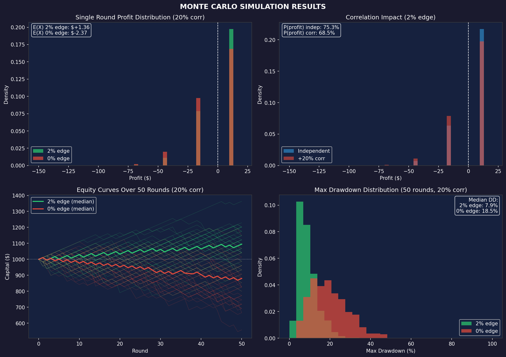

# POLYMARKET INVESTMENT BRIEFING
## January 16, 2026

---

# EXECUTIVE SUMMARY

| Metric | IF 2% Edge | IF 0% Edge |
|--------|------------|------------|
| Markets Analyzed | 200 | 200 |
| Trades Executed | 6 | 6 |
| Capital Required | $150 | $150 |
| P(all 6 win) | **69.2%** | **58.5%** |
| P(at least 1 loss) | 30.8% | **41.5%** |
| E(X) per round | **+$1.60** | **-$0.20** |

**Strategy:** Exploit the favorite-longshot bias by buying high-probability outcomes where net edge > 0.5%.

**Two Scenarios (both shown with 20% correlation):**
- **IF 2% edge exists:** 69%/31% bet, E(X) = +$1.60/round
- **IF markets efficient:** 59%/41% bet, E(X) = -$0.20/round

**Bottom Line:** Win all 6: +$11. Lose any: -$16 to -$150. The edge is UNVALIDATED.

---

# FEE STRUCTURE

## Polymarket Trading Fees

| Fee Type | Cost | Source |
|----------|------|--------|
| **Maker fee** | 0% | [Polymarket Docs](https://docs.polymarket.com/polymarket-learn/trading/fees) |
| **Taker fee** | 0% (most markets) | Same |
| **15-min crypto markets** | Up to 3% at 50% prob | [TradingView](https://www.tradingview.com/news/cointelegraph:e59c32089094b:0/) |
| **Deposit (USDC)** | Free | Polygon network |
| **Withdrawal** | ~$0.01-0.05 | Polygon gas |
| **Settlement** | 0% | Winners get $1.00/share |

## Actual Bid-Ask Spreads (From Live Order Books)

| Market | Liquidity | **Actual Spread** |
|--------|-----------|-------------------|
| Super Bowl markets | $1M+ | **0.11%** |
| 49ers NFC | $74K | **0.22%** |
| Rob Jetten (Politics) | Low | **0.31%** |
| McMillan OROY | $5K | **0.65%** |
| Dart OROY | Low | **1.77%** |
| Protector of Year | <$500 | **8-18%** |

**Key Finding:** Liquid markets have 0.1-0.3% spreads — much tighter than estimated.

---

# THEORETICAL FOUNDATION

## The Favorite-Longshot Bias

### Academic Sources

**Kahneman & Tversky (1979)**
*Prospect Theory: An Analysis of Decision under Risk.* Econometrica, 47(2), 263-291.

> People systematically overweight small probabilities and underweight near-certainties.

| True Probability | Perceived Weight | Effect |
|-----------------|------------------|--------|
| 1% | ~5.5% | Longshots overbid 5.5x |
| 5% | ~13.2% | Longshots overbid 2.6x |
| 95% | ~79.3% | **Favorites underbid** |
| 99% | ~91.2% | **Favorites underbid** |

**Snowberg & Wolfers (2010)**
*Explaining the Favorite-Long Shot Bias.* [NBER Working Paper 15923](https://www.nber.org/papers/w15923).

| Implied Prob | Actual Win Rate | Edge |
|--------------|-----------------|------|
| 90.9% | 93.2% | **+2.3%** |
| 95.2% | 97.1% | **+1.9%** |
| 98.0% | 98.9% | **+0.9%** |

### Why It Persists

| Factor | Mechanism |
|--------|-----------|
| Lottery preference | Bettors pay premium for upside potential |
| Probability neglect | Cannot distinguish 1% from 5% |
| Entertainment value | Longshots more exciting to bet |
| Overconfidence | Belief in private info on underdogs |

**Caveat:** This bias is documented in horse racing and sports betting. It has NOT been validated on Polymarket with historical data.

---

# MARKET ANALYSIS

## All 17 Markets in 90-96% Zone (Sorted by Spread)

| Market | Side | Price | Spread | Net Edge | E(X)/$25 | Tradeable |
|--------|------|-------|--------|----------|----------|-----------|
| 49ers Super Bowl | NO | 95.2% | 0.11% | 1.89% | **$0.50** | **YES** |
| Bears Super Bowl | NO | 94.5% | 0.11% | 1.89% | **$0.50** | **YES** |
| Texans Super Bowl | NO | 91.0% | 0.11% | 1.89% | **$0.52** | **YES** |
| 49ers NFC | NO | 90.4% | 0.22% | 1.78% | **$0.49** | **YES** |
| Rob Jetten (NL PM) | YES | 95.8% | 0.31% | 1.69% | **$0.44** | **YES** |
| McMillan OROY | YES | 92.3% | 0.65% | 1.35% | **$0.37** | **YES** |
| Jaxson Dart OROY | NO | 96.0% | 1.77% | 0.23% | **$0.06** | **YES** |
| McCaffrey Comeback | YES | 93.0% | 2.15% | -0.15% | -$0.04 | NO |
| DOGE Cuts <$50B | YES | 94.1% | 2.66% | -0.66% | -$0.17 | NO |
| Kyle Shanahan COY | NO | 95.3% | 2.73% | -0.73% | -$0.19 | NO |
| Schwesinger DROY | YES | 94.5% | 3.17% | -1.17% | -$0.31 | NO |
| Andrew Wylie Protector | NO | 95.5% | 8.35% | -6.35% | -$1.66 | NO |
| Charles Cross Protector | NO | 95.7% | 8.57% | -6.57% | -$1.72 | NO |
| Ryan Kelly Protector | NO | 93.9% | 12.57% | -10.57% | -$2.81 | NO |
| Lane Johnson Protector | NO | 92.4% | 16.02% | -14.02% | -$3.79 | NO |
| Cam Jurgens Protector | NO | 92.4% | 16.02% | -14.02% | -$3.79 | NO |
| Penei Sewell Protector | NO | 91.0% | 18.46% | -16.46% | -$4.52 | NO |

**Net Edge = 2% (theoretical) - Spread**

---

# ACTIONABLE TRADES

## Portfolio: 6 Markets × $25 = $150

| # | Market | Side | Price | Spread | Net Edge | Edge/Spread |
|---|--------|------|-------|--------|----------|-------------|
| 1 | 49ers Super Bowl | NO | 95.2% | 0.11% | 1.89% | **17.2x** |
| 2 | Bears Super Bowl | NO | 94.5% | 0.11% | 1.89% | **17.2x** |
| 3 | Texans Super Bowl | NO | 91.0% | 0.11% | 1.89% | **17.2x** |
| 4 | 49ers NFC | NO | 90.4% | 0.22% | 1.78% | **8.1x** |
| 5 | Rob Jetten NL PM | YES | 95.8% | 0.31% | 1.69% | **5.5x** |
| 6 | McMillan OROY | YES | 92.3% | 0.65% | 1.35% | **2.1x** |

**Win if all 6 correct:** +$11.02
**Lose if any wrong:** -$15.81 to -$150.00

### Why These 6?
- All have Edge/Spread > 2x (margin of safety)
- Jaxson Dart OROY excluded: Edge/Spread = 0.1x (too thin)

### Category Diversification

| Category | Trades | Correlation Risk |
|----------|--------|------------------|
| NFL Super Bowl | 3 | Correlated |
| NFL Conference | 1 | Correlated |
| NFL Rookie | 1 | Correlated |
| International Politics | 1 | Independent |

**Warning:** 5 of 6 trades are NFL-related. A single event (e.g., referee scandal, weather) could affect multiple outcomes.

---

# EXPECTED VALUE ANALYSIS

## Two Scenarios Compared

This analysis shows BOTH scenarios with equal weight since the 2% edge is unvalidated:

| Metric | IF 2% Edge | IF 0% Edge |
|--------|------------|------------|
| P(all 6 win) - independent | 74.3% | 65.4% |
| P(all 6 win) - with 20% corr | **69.2%** | **58.5%** |
| E(X) - independent | +$3.30 | -$0.01 |
| E(X) - with 20% corr | **+$1.60** | **-$0.20** |

## Outcome Distribution (with 20% correlation)

| Outcome | P (2% edge) | P (0% edge) | Profit |
|---------|-------------|-------------|--------|
| 6W/0L | **69.2%** | **58.5%** | +$11.02 |
| 5W/1L | 26.8% | 33.7% | -$15.81 |
| 4W/2L | 3.8% | 7.0% | -$42.65 |
| 3W/3L | 0.3% | 0.7% | -$69.49 |
| Worse | <0.1% | <0.1% | -$96 to -$150 |

**Critical:** You must win ALL 6 to profit. One loss wipes gains and goes negative.

## E(X) Sensitivity

| Assumed Edge | E(X) | ROI | P(Profit) |
|--------------|------|-----|-----------|
| 0% (efficient) | -$0.20 | -0.1% | 58.5% |
| 1% | +$0.70 | +0.5% | 63.5% |
| **2% (research)** | **+$1.60** | **+1.1%** | **69.2%** |
| 3% | +$2.50 | +1.7% | 74.5% |
| 4% | +$3.40 | +2.3% | 79.5% |

All values assume 20% correlation adjustment for NFL clustering.

---

# RISK ASSESSMENT

## Risk Metrics (with 20% correlation)

| Metric | IF 2% Edge | IF 0% Edge |
|--------|------------|------------|
| P(profit) | 69.2% | 58.5% |
| P(loss) | 30.8% | 41.5% |
| E(X) | +$1.60 | -$0.20 |
| VaR 95% | -$15.81 | -$42.65 |
| VaR 99% | -$42.65 | -$42.65 |
| E(Loss \| Loss) | -$19.57 | -$21.37 |
| Max Loss | -$150 | -$150 |

## Correlation Impact

5 of 6 trades are NFL-related. Correlation adjustment increases loss probability:

| Correlation | P(win) 2% edge | P(win) 0% edge | E(X) 2% edge |
|-------------|----------------|----------------|--------------|
| Independent | 74.3% | 65.4% | +$3.30 |
| +10% corr | 71.8% | 62.0% | +$2.39 |
| **+20% corr** | **69.2%** | **58.5%** | **+$1.60** |
| +30% corr | 66.6% | 55.1% | +$0.82 |

## Position Sizing

With $150 across 6 markets:
- Capital per trade: $25 (17% of portfolio)
- Win all 6: +$11.02 (+7.3% return)
- Lose 1: -$15.81 (-10.5% return)
- Max loss: -$150 (-100% of deployed capital)

---

# MONTE CARLO SIMULATION

## Single Round Results (10,000 simulations)

| Scenario | P(profit) | E(X) | P5 | P50 | P95 |
|----------|-----------|------|-----|-----|-----|
| 2% edge, independent | 75.3% | +$3.67 | -$16 | +$11 | +$11 |
| 2% edge, +20% corr | **68.5%** | **+$1.36** | -$16 | +$11 | +$11 |
| 0% edge, independent | 65.8% | +$0.19 | -$43 | +$11 | +$11 |
| 0% edge, +20% corr | **58.5%** | **-$2.37** | -$43 | +$11 | +$11 |

## Multi-Round Projections (50 rounds, $1000 starting capital)

| Scenario | Final Avg | Final Median | Max DD | P(Bust) |
|----------|-----------|--------------|--------|---------|
| 2% edge, independent | $1,164 | $1,176 | 6.5% | 0% |
| 2% edge, +20% corr | **$1,081** | **$1,095** | **8.9%** | **0%** |
| 0% edge, independent | $996 | $1,014 | 12.8% | 0% |
| 0% edge, +20% corr | **$877** | **$880** | **19.6%** | **0%** |

**Key Finding:** Without edge, capital decays ~12% over 50 rounds. With edge, capital grows ~8%.

---

# PROJECTIONS

## Single Round ($150 deployed, ~3-4 week settlement)

**Timeline:** NFL markets settle by Super Bowl (Feb 9, 2026). Rob Jetten market TBD.

| Scenario | P (2% edge) | P (0% edge) | Profit |
|----------|-------------|-------------|--------|
| All 6 win | **69.2%** | **58.5%** | +$11.02 |
| 5 win, 1 lose | 26.8% | 33.7% | -$15.81 |
| 4 win, 2 lose | 3.8% | 7.0% | -$42.65 |
| Worse | <1% | <1% | -$69+ |

**Expected Value (with 20% correlation):**
- If 2% edge exists: **+$1.60** per round
- If 0% edge (efficient): **-$0.20** per round (spread cost)

---

# RECOMMENDATION

## Execute Now (6 trades)

| Market | Side | Price | Spread | Edge/Spread | Amount |
|--------|------|-------|--------|-------------|--------|
| 49ers Super Bowl | NO | 95.2% | 0.11% | 17.2x | $25 |
| Bears Super Bowl | NO | 94.5% | 0.11% | 17.2x | $25 |
| Texans Super Bowl | NO | 91.0% | 0.11% | 17.2x | $25 |
| 49ers NFC | NO | 90.4% | 0.22% | 8.1x | $25 |
| Rob Jetten NL PM | YES | 95.8% | 0.31% | 5.5x | $25 |
| McMillan OROY | YES | 92.3% | 0.65% | 2.1x | $25 |

**Total: $150**

## Do Not Trade

| Market | Reason |
|--------|--------|
| Jaxson Dart OROY | Edge/Spread = 0.1x (too thin) |
| McCaffrey Comeback | Spread > edge |
| DOGE Cuts | Spread > edge |
| Protector of Year | Spreads 8-18% |

## Track These Metrics

1. **Fill price vs. mid price** — actual slippage
2. **Resolution outcomes** — build dataset to validate edge
3. **Cumulative P&L** — does realized return match expected?

---

# APPENDIX

## Visualizations

| File | Description |
|------|-------------|
| `advanced_risk_analysis.png` | **4-panel risk analysis with correlation** |
| `monte_carlo_simulation.png` | **Monte Carlo: profit distribution & equity curves** |
| `correlation_comparison.png` | **Correlation impact comparison** |
| `honest_summary.png` | Market distribution by probability zone |
| `honest_distribution.png` | Probability zone breakdown |

## Data Sources

- **Prices/Spreads:** Polymarket CLOB API (live order books)
- **Research:** Kahneman & Tversky (1979), Snowberg & Wolfers (2010)
- **Fee Structure:** [Polymarket Documentation](https://docs.polymarket.com/polymarket-learn/trading/fees)

## Methodology Notes

1. **Spread calculation:** (Best Ask - Best Bid) / Midpoint × 100
2. **Net edge:** Assumed 2% gross edge (from research) minus actual spread
3. **E(X):** $25 × Net Edge / Price
4. **Probability:** Product of individual market probabilities (assumes independence)

---

*Generated: January 16, 2026*
*Data: Live Polymarket API with real order book spreads*
*Status: Theoretical edge UNVALIDATED on Polymarket*
